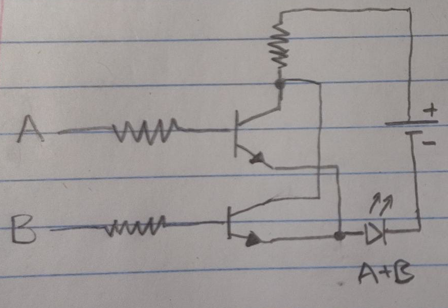
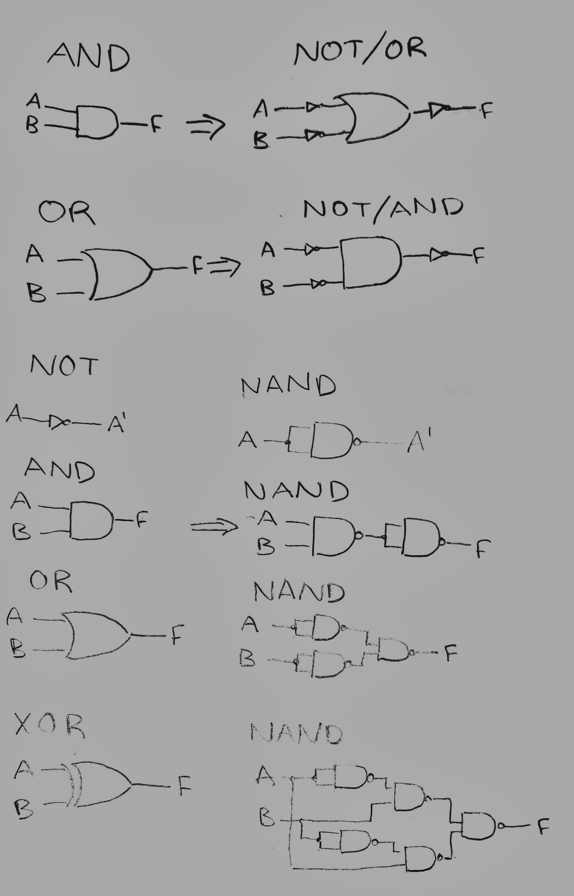

# CPE 1040 - Spring 2020
```
  _           _       _   _       _       _                 _    
 | |         | |     | \ | |     | |     | |               | |   
 | |     __ _| |__   |  \| | ___ | |_ ___| |__   ___   ___ | | __
 | |    / _` | '_ \  | . ` |/ _ \| __/ _ \ '_ \ / _ \ / _ \| |/ /
 | |___| (_| | |_) | | |\  | (_) | ||  __/ |_) | (_) | (_) |   < 
 |______\__,_|_.__/  |_| \_|\___/ \__\___|_.__/ \___/ \___/|_|\_\
                                                                                                                      
```
Art acknowledgement: [taag](http://patorjk.com/software/taag/)
---

**NOTE:** 
1. This lesson & assignment [README](README.md) is _intentionally_ blank, to be used as the Lab Notebook for the study & submission. _It is a great aid for your study and the main component of your submission._
2. Read and follow the [lesson-and-assignment](lesson-and-assignment.md).
2. Refer to the [submission template](submission-template.md) for formatting expectations and examples. 
4. Refer to the [criteria and guide](criteria-and-guide.md) for the different components of your submission.
---
## Section 1: AND, OR, and NOT gates from NPN transistors
1. The following truth tables show DeMorgan's Law:

   | A        | B        | A'       | B'       | A' * B'  | (A + B)' | A' * B' -> (A + B)' |
   |:--------:|:--------:|:--------:|:--------:|:--------:|:--------:|:--------:|
   | 0        | 0        | 1        | 1        | 1        | 1        | True     |
   | 0        | 1        | 1        | 0        | 0        | 0        | True     |
   | 1        | 0        | 0        | 1        | 0        | 0        | True     |
   | 1        | 1        | 0        | 0        | 0        | 0        | True     |

   | A        | B        | A'       | B'       | A' + B'  | (A * B)' | A' + B' -> (A * B)' |
   |:--------:|:--------:|:--------:|:--------:|:--------:|:--------:|:--------:|
   | 0        | 0        | 1        | 1        | 1        | 1        | True     |
   | 0        | 1        | 1        | 0        | 1        | 1        | True     |
   | 1        | 0        | 0        | 1        | 1        | 1        | True     |
   | 1        | 1        | 0        | 0        | 0        | 0        | True     |


1. In this experiment, two basic gates were built out of NPN transistors -- an inverter and an OR gate.

   _Inverter_

   The design I followed for the inverter has one NPN transistor with a 1kΩ resistor connecting the +5V line to the collector, this same resistor also powers an LED that is connected directly to ground. The base of the transistor is connected to the power line through a 1kΩ resistor and a button. The emitter is connected directly to ground. When the button is not pressed the base is not powered, so this circuit lights an LED (the "0" input causes the output to be "1") because the path for current has much less resistance going through the LED to ground than through the transistor to ground. When the base of the transistor is powered by pushing the button, the LED flips off ("1" becomes "0") because the path through the transistor essentially has no resistance, shorting the LED.

   _OR Gate_

   Using my understanding of the transistors and the experience with the inverter from the previous part of this experiment, I designed an OR gate using two transistors. In my design, the collectors for both transistors are connected to power through 1kΩ resistors, the bases are connected to either input (A and B), and both emitters are connected to ground through the same LED. When neither of the input buttons are pressed, no current can make it through the transistors to power the LED (0+0 = 0). When either or both of the inputs are pressed, powering the bases, the transistors create a path for current through the LED to the ground (0+1 = 1+0 = 1+1 = 1).

   

   _Automating Inputs_

   To automatically cycle through 2^2 = 4 possible inputs, a short program was written for the microbit to cause A and B to cycle through 00, 01, 10, and 11. These variables to were used to set the digital write pins 12 and 14, which were in turn connected through the LLC to the bases of the transistors.

2. [1.2.2 Inverter](https://i.imgur.com/vnHR0Iu.mp4)
3. [1.2.3 OR Gate](https://i.imgur.com/MP3CHD3.mp4)
4. [1.2.5 Automated Input](https://i.imgur.com/MmYteJX.mp4)

## Section 2: Drive and Read NPN Based Gates

1. In this experiment I constructed an OR gate an and AND gate using NPN transistors. In contrast to the OR gate, the AND gate was constructed using the transistors in series, rather than parallel. So, the emitter of the first transistor was connected to the collector of the next. All of the resistors from the previous experiment were initially replaced with 10kΩ resistors, however the 10kΩ resistor could not be used at the collector when driving input to the microbit, as explained below.

   As was the case in previous experiments, I had issues with my LLC and I used a voltage divider to drive input to the microbit instead. I connected a 220Ω resistor to the collector of my transistors and a 330Ω resistor in between the output and the ground. I connected this to my multimeter first in order to verify that it was outputting approximately 3V, before using it as input for my microbit.
2. With the voltage divider, the gate was outputting between 0V and 2.97V. The program mapped 0V to 0 brightness and 2.97V to full (255) brightness.
3. The OR gate appears to be operating properly, as the output LED on the microbit shows the correct result. The output LED also appears to be the same brightness regardless of whether the input is 01/10 or 11, indicating a digital result.

   The AND gate gives slightly erroneous output when being read as an analog input. When the output is 10, the output LED comes on dimly and the voltage being read is 0.11V instead of 0. With the output of 11, the voltage is 3.25V and the output LED is fully illuminated. In the case where there is an erroneous signal, the pin being powered connects to the second transistor in the series, indicating that closing this switch causes some voltage leak from an unknown source.

_Due to time constraints, I have not included all of the gates for each section._

4. [2.2.4 OR Gate](https://i.imgur.com/2L5VlLs.mp4)
   
   [2.2.4 AND Gate](https://i.imgur.com/Yl1woVs.mp4)
5. [2.2.5 AND Gate](https://i.imgur.com/p2b6wGA.mp4)

## Section 3: Logic Gate ICs

1. In this experiment integrated circuit logic gates were used instead of individual transistors. A large part of performing this experiment correctly was dependent upon reading the datasheets for each chip in order to connect them to power, ground, input(s) and output. 

   For part 3.2.2, the same code was used on the microbit as in the previous experiment.
   
   For part 3.2.3, the code was modified to switch the 74135 selector bit and display the output that was being written to this pin. This code sucessfully switched the output between XOR and XNOR.
   
2. Each of these voltage measurements were taken relative to ground, between a resistor and an output LED.

   The inverter output voltage was measured as 2.89V high and 0.08V low.

   The OR gate output voltage was 2.80V high and 0.06V low.
   
   The AND gate output voltage was 2.82V high and 0.09V low.
   
   The NAND gate output voltage 2.67V high and 0.16V low.
   
   The XOR gate output voltage was 2.68V high and 0.09V low.

3. [Inverter 3.2.2](https://i.imgur.com/LOcY5nX.mp4)

   [AND 3.2.2](https://i.imgur.com/U1ymvu4.mp4)
   
   [OR 3.2.2](https://i.imgur.com/UIclu2T.mp4)
   
   [NAND 3.2.2](https://i.imgur.com/ltuDNBw.mp4)
   
   [XOR 3.2.2](https://i.imgur.com/nvwwXtt.mp4)
   
4. [XOR/XNOR 3.2.3](https://i.imgur.com/qvVxo3s.mp4)
   
## Section 4: Combinational Logic

1. In this experiment, various basic gates were built out of universal gates or gate sets. The microbit code from the previous section was modified to read from a second input pin connected to an equivalent gate and display the result on the built-in LED directly to the right of the output from the original gate. One the breadboard, each basic gate was constructed on the right and its logical equivalent was constructed to the left. The output on the microbit confirmed that each set of circuits produced equivalent output.

   For my NAND gate XOR design, I required 5 NAND gates. Unfortunately when I plugged in my second 7400 NAND chip for the final gate, I was receiving a constant high signal from the output. Upon checking the intermediate outputs I determined that the second chip was the source of the problem. To simulate another NAND gate I used a 7408 AND followed by a 7404 inverter and I verified that the output was correct.

   | Output   | Gate     | Boolean Expression | 
   |:--------:|:--------:|:--------:|
   | 0000     | A _AND NOT_ A | A*A'     |
   | 0001     | _AND_ | A*B |
   | 0010     | A _AND NOT_ B | A*B' |
   | 0011     | This does not require a gate. | A |
   | 0100     | _NOT_ A _AND_ B | A'*B |
   | 0101     | This does not require a gate. | B |
   | 0110     | _XOR_ | A⊕B |
   | 0111     | _OR_ | A+B |
   | 1000     | _NOR_ | (A+B)' |
   | 1001     | _XNOR_ | (A⊕B)' |
   | 1010     | _NOT_ B | B' |
   | 1011     | B _NAND_ (A _NAND_ B) | (B*(A*B)')' |
   | 1100     | _NOT_ A | A' |
   | 1101     | A _NAND_ (A _NAND_ B) | (A*(A*B)')' |
   | 1110     | NAND | (A*B)' |
   | 1111     | A _OR NOT_ A | A+A' |

2. Basic gates from combinations of universal gates:

   
   
3. [AND & NOT/OR](https://i.imgur.com/IYGJG0b.mp4)

   [OR & NOT/AND](https://i.imgur.com/9G0rhnF.mp4)
   
   [NOT & NAND](https://i.imgur.com/VuTitY2.mp4)
   
   [AND & NAND](https://i.imgur.com/GCJSM2B.mp4)
   
   [OR & NAND](https://i.imgur.com/5Ey0Wvg.mp4)
   
   [XOR & NAND](https://i.imgur.com/dVqe3Dx.mp4)

## Section 5: Microbit Logic Analyzer

1. In this experiment, the microbit code from the previous experiment was modified to show output from the logic gates line-by-line. The microbit stores the output from each input combination in an array, which it passes to a function that determines which (if any) of the basic gates it represents. The microbit then displays the result on the screen or says "No name" for a logic function which is not identifiable as a basic gate. 

   If the code detects an XOR gate, it assumes that it is connected to the XOR/XNOR chip and powers an additional output pin to switch the chip to XNOR mode. It then displays the next set of results line-by-line next to the XOR results before running a second analysis and confirming that it is XNOR.
   
   I used the same code for both sections of this assignment as I misunderstood the instructions. However, the code works for both parts.

   _NOR Exhaustive Truth Table_
   | A | B | C | D | E | F | G | H | _Q_ |
   |:-:|:-:|:-:|:-:|:-:|:-:|:-:|:-:|:-:|
   | 0 | 0 | 0 | 0 | 0 | 0 | 0 | 0 | 1 |
   | 0 | 0 | 0 | 0 | 0 | 0 | 0 | 1 | 0 |
   | 0 | 0 | 0 | 0 | 0 | 0 | 1 | 0 | 0 |
   | 0 | 0 | 0 | 0 | 0 | 0 | 1 | 1 | 0 |
   | 0 | 0 | 0 | 0 | 0 | 1 | 0 | 0 | 0 |
   | 0 | 0 | 0 | 0 | 0 | 1 | 0 | 1 | 0 |
   | 0 | 0 | 0 | 0 | 0 | 1 | 1 | 0 | 0 |
   | 0 | 0 | 0 | 0 | 0 | 1 | 1 | 1 | 0 |
   | 0 | 0 | 0 | 0 | 1 | 0 | 0 | 0 | 0 |
   | 0 | 0 | 0 | 0 | 1 | 0 | 0 | 1 | 0 |
   | 0 | 0 | 0 | 0 | 1 | 0 | 1 | 0 | 0 |
   | 0 | 0 | 0 | 0 | 1 | 0 | 1 | 1 | 0 |
   | 0 | 0 | 0 | 0 | 1 | 1 | 0 | 0 | 0 |
   | 0 | 0 | 0 | 0 | 1 | 1 | 0 | 1 | 0 |
   | 0 | 0 | 0 | 0 | 1 | 1 | 1 | 0 | 0 |
   | 0 | 0 | 0 | 0 | 1 | 1 | 1 | 1 | 0 |
   | 0 | 0 | 0 | 1 | 0 | 0 | 0 | 0 | 0 |
   | 0 | 0 | 0 | 1 | 0 | 0 | 0 | 1 | 0 |
   | 0 | 0 | 0 | 1 | 0 | 0 | 1 | 0 | 0 |
   | 0 | 0 | 0 | 1 | 0 | 0 | 1 | 1 | 0 |
   | 0 | 0 | 0 | 1 | 0 | 1 | 0 | 0 | 0 |
   | 0 | 0 | 0 | 1 | 0 | 1 | 0 | 1 | 0 |
   | 0 | 0 | 0 | 1 | 0 | 1 | 1 | 0 | 0 |
   | 0 | 0 | 0 | 1 | 0 | 1 | 1 | 1 | 0 |
   | 0 | 0 | 0 | 1 | 1 | 0 | 0 | 0 | 0 |
   | 0 | 0 | 0 | 1 | 1 | 0 | 0 | 1 | 0 |
   | 0 | 0 | 0 | 1 | 1 | 0 | 1 | 0 | 0 |
   | 0 | 0 | 0 | 1 | 1 | 0 | 1 | 1 | 0 |
   | 0 | 0 | 0 | 1 | 1 | 1 | 0 | 0 | 0 |
   | 0 | 0 | 0 | 1 | 1 | 1 | 0 | 1 | 0 |
   | 0 | 0 | 0 | 1 | 1 | 1 | 1 | 0 | 0 |
   | 0 | 0 | 0 | 1 | 1 | 1 | 1 | 1 | 0 |
   | 0 | 0 | 1 | 0 | 0 | 0 | 0 | 0 | 0 |
   | 0 | 0 | 1 | 0 | 0 | 0 | 0 | 1 | 0 |
   | 0 | 0 | 1 | 0 | 0 | 0 | 1 | 0 | 0 |
   | 0 | 0 | 1 | 0 | 0 | 0 | 1 | 1 | 0 |
   | 0 | 0 | 1 | 0 | 0 | 1 | 0 | 0 | 0 |
   | 0 | 0 | 1 | 0 | 0 | 1 | 0 | 1 | 0 |
   | 0 | 0 | 1 | 0 | 0 | 1 | 1 | 0 | 0 |
   | 0 | 0 | 1 | 0 | 0 | 1 | 1 | 1 | 0 |
   | 0 | 0 | 1 | 0 | 1 | 0 | 0 | 0 | 0 |
   | 0 | 0 | 1 | 0 | 1 | 0 | 0 | 1 | 0 |
   | 0 | 0 | 1 | 0 | 1 | 0 | 1 | 0 | 0 |
   | 0 | 0 | 1 | 0 | 1 | 0 | 1 | 1 | 0 |
   | 0 | 0 | 1 | 0 | 1 | 1 | 0 | 0 | 0 |
   | 0 | 0 | 1 | 0 | 1 | 1 | 0 | 1 | 0 |
   | 0 | 0 | 1 | 0 | 1 | 1 | 1 | 0 | 0 |
   | 0 | 0 | 1 | 0 | 1 | 1 | 1 | 1 | 0 |
   | 0 | 0 | 1 | 1 | 0 | 0 | 0 | 0 | 0 |
   | 0 | 0 | 1 | 1 | 0 | 0 | 0 | 1 | 0 |
   | 0 | 0 | 1 | 1 | 0 | 0 | 1 | 0 | 0 |
   | 0 | 0 | 1 | 1 | 0 | 0 | 1 | 1 | 0 |
   | 0 | 0 | 1 | 1 | 0 | 1 | 0 | 0 | 0 |
   | 0 | 0 | 1 | 1 | 0 | 1 | 0 | 1 | 0 |
   | 0 | 0 | 1 | 1 | 0 | 1 | 1 | 0 | 0 |
   | 0 | 0 | 1 | 1 | 0 | 1 | 1 | 1 | 0 |
   | 0 | 0 | 1 | 1 | 1 | 0 | 0 | 0 | 0 |
   | 0 | 0 | 1 | 1 | 1 | 0 | 0 | 1 | 0 |
   | 0 | 0 | 1 | 1 | 1 | 0 | 1 | 0 | 0 |
   | 0 | 0 | 1 | 1 | 1 | 0 | 1 | 1 | 0 |
   | 0 | 0 | 1 | 1 | 1 | 1 | 0 | 0 | 0 |
   | 0 | 0 | 1 | 1 | 1 | 1 | 0 | 1 | 0 |
   | 0 | 0 | 1 | 1 | 1 | 1 | 1 | 0 | 0 |
   | 0 | 0 | 1 | 1 | 1 | 1 | 1 | 1 | 0 |
   | 0 | 1 | 0 | 0 | 0 | 0 | 0 | 0 | 0 |
   | 0 | 1 | 0 | 0 | 0 | 0 | 0 | 1 | 0 |
   | 0 | 1 | 0 | 0 | 0 | 0 | 1 | 0 | 0 |
   | 0 | 1 | 0 | 0 | 0 | 0 | 1 | 1 | 0 |
   | 0 | 1 | 0 | 0 | 0 | 1 | 0 | 0 | 0 |
   | 0 | 1 | 0 | 0 | 0 | 1 | 0 | 1 | 0 |
   | 0 | 1 | 0 | 0 | 0 | 1 | 1 | 0 | 0 |
   | 0 | 1 | 0 | 0 | 0 | 1 | 1 | 1 | 0 |
   | 0 | 1 | 0 | 0 | 1 | 0 | 0 | 0 | 0 |
   | 0 | 1 | 0 | 0 | 1 | 0 | 0 | 1 | 0 |
   | 0 | 1 | 0 | 0 | 1 | 0 | 1 | 0 | 0 |
   | 0 | 1 | 0 | 0 | 1 | 0 | 1 | 1 | 0 |
   | 0 | 1 | 0 | 0 | 1 | 1 | 0 | 0 | 0 |
   | 0 | 1 | 0 | 0 | 1 | 1 | 0 | 1 | 0 |
   | 0 | 1 | 0 | 0 | 1 | 1 | 1 | 0 | 0 |
   | 0 | 1 | 0 | 0 | 1 | 1 | 1 | 1 | 0 |
   | 0 | 1 | 0 | 1 | 0 | 0 | 0 | 0 | 0 |
   | 0 | 1 | 0 | 1 | 0 | 0 | 0 | 1 | 0 |
   | 0 | 1 | 0 | 1 | 0 | 0 | 1 | 0 | 0 |
   | 0 | 1 | 0 | 1 | 0 | 0 | 1 | 1 | 0 |
   | 0 | 1 | 0 | 1 | 0 | 1 | 0 | 0 | 0 |
   | 0 | 1 | 0 | 1 | 0 | 1 | 0 | 1 | 0 |
   | 0 | 1 | 0 | 1 | 0 | 1 | 1 | 0 | 0 |
   | 0 | 1 | 0 | 1 | 0 | 1 | 1 | 1 | 0 |
   | 0 | 1 | 0 | 1 | 1 | 0 | 0 | 0 | 0 |
   | 0 | 1 | 0 | 1 | 1 | 0 | 0 | 1 | 0 |
   | 0 | 1 | 0 | 1 | 1 | 0 | 1 | 0 | 0 |
   | 0 | 1 | 0 | 1 | 1 | 0 | 1 | 1 | 0 |
   | 0 | 1 | 0 | 1 | 1 | 1 | 0 | 0 | 0 |
   | 0 | 1 | 0 | 1 | 1 | 1 | 0 | 1 | 0 |
   | 0 | 1 | 0 | 1 | 1 | 1 | 1 | 0 | 0 |
   | 0 | 1 | 0 | 1 | 1 | 1 | 1 | 1 | 0 |
   | 0 | 1 | 1 | 0 | 0 | 0 | 0 | 0 | 0 |
   | 0 | 1 | 1 | 0 | 0 | 0 | 0 | 1 | 0 |
   | 0 | 1 | 1 | 0 | 0 | 0 | 1 | 0 | 0 |
   | 0 | 1 | 1 | 0 | 0 | 0 | 1 | 1 | 0 |
   | 0 | 1 | 1 | 0 | 0 | 1 | 0 | 0 | 0 |
   | 0 | 1 | 1 | 0 | 0 | 1 | 0 | 1 | 0 |
   | 0 | 1 | 1 | 0 | 0 | 1 | 1 | 0 | 0 |
   | 0 | 1 | 1 | 0 | 0 | 1 | 1 | 1 | 0 |
   | 0 | 1 | 1 | 0 | 1 | 0 | 0 | 0 | 0 |
   | 0 | 1 | 1 | 0 | 1 | 0 | 0 | 1 | 0 |
   | 0 | 1 | 1 | 0 | 1 | 0 | 1 | 0 | 0 |
   | 0 | 1 | 1 | 0 | 1 | 0 | 1 | 1 | 0 |
   | 0 | 1 | 1 | 0 | 1 | 1 | 0 | 0 | 0 |
   | 0 | 1 | 1 | 0 | 1 | 1 | 0 | 1 | 0 |
   | 0 | 1 | 1 | 0 | 1 | 1 | 1 | 0 | 0 |
   | 0 | 1 | 1 | 0 | 1 | 1 | 1 | 1 | 0 |
   | 0 | 1 | 1 | 1 | 0 | 0 | 0 | 0 | 0 |
   | 0 | 1 | 1 | 1 | 0 | 0 | 0 | 1 | 0 |
   | 0 | 1 | 1 | 1 | 0 | 0 | 1 | 0 | 0 |
   | 0 | 1 | 1 | 1 | 0 | 0 | 1 | 1 | 0 |
   | 0 | 1 | 1 | 1 | 0 | 1 | 0 | 0 | 0 |
   | 0 | 1 | 1 | 1 | 0 | 1 | 0 | 1 | 0 |
   | 0 | 1 | 1 | 1 | 0 | 1 | 1 | 0 | 0 |
   | 0 | 1 | 1 | 1 | 0 | 1 | 1 | 1 | 0 |
   | 0 | 1 | 1 | 1 | 1 | 0 | 0 | 0 | 0 |
   | 0 | 1 | 1 | 1 | 1 | 0 | 0 | 1 | 0 |
   | 0 | 1 | 1 | 1 | 1 | 0 | 1 | 0 | 0 |
   | 0 | 1 | 1 | 1 | 1 | 0 | 1 | 1 | 0 |
   | 0 | 1 | 1 | 1 | 1 | 1 | 0 | 0 | 0 |
   | 0 | 1 | 1 | 1 | 1 | 1 | 0 | 1 | 0 |
   | 0 | 1 | 1 | 1 | 1 | 1 | 1 | 0 | 0 |
   | 0 | 1 | 1 | 1 | 1 | 1 | 1 | 1 | 0 |
   | 1 | 0 | 0 | 0 | 0 | 0 | 0 | 0 | 0 |
   | 1 | 0 | 0 | 0 | 0 | 0 | 0 | 1 | 0 |
   | 1 | 0 | 0 | 0 | 0 | 0 | 1 | 0 | 0 |
   | 1 | 0 | 0 | 0 | 0 | 0 | 1 | 1 | 0 |
   | 1 | 0 | 0 | 0 | 0 | 1 | 0 | 0 | 0 |
   | 1 | 0 | 0 | 0 | 0 | 1 | 0 | 1 | 0 |
   | 1 | 0 | 0 | 0 | 0 | 1 | 1 | 0 | 0 |
   | 1 | 0 | 0 | 0 | 0 | 1 | 1 | 1 | 0 |
   | 1 | 0 | 0 | 0 | 1 | 0 | 0 | 0 | 0 |
   | 1 | 0 | 0 | 0 | 1 | 0 | 0 | 1 | 0 |
   | 1 | 0 | 0 | 0 | 1 | 0 | 1 | 0 | 0 |
   | 1 | 0 | 0 | 0 | 1 | 0 | 1 | 1 | 0 |
   | 1 | 0 | 0 | 0 | 1 | 1 | 0 | 0 | 0 |
   | 1 | 0 | 0 | 0 | 1 | 1 | 0 | 1 | 0 |
   | 1 | 0 | 0 | 0 | 1 | 1 | 1 | 0 | 0 |
   | 1 | 0 | 0 | 0 | 1 | 1 | 1 | 1 | 0 |
   | 1 | 0 | 0 | 1 | 0 | 0 | 0 | 0 | 0 |
   | 1 | 0 | 0 | 1 | 0 | 0 | 0 | 1 | 0 |
   | 1 | 0 | 0 | 1 | 0 | 0 | 1 | 0 | 0 |
   | 1 | 0 | 0 | 1 | 0 | 0 | 1 | 1 | 0 |
   | 1 | 0 | 0 | 1 | 0 | 1 | 0 | 0 | 0 |
   | 1 | 0 | 0 | 1 | 0 | 1 | 0 | 1 | 0 |
   | 1 | 0 | 0 | 1 | 0 | 1 | 1 | 0 | 0 |
   | 1 | 0 | 0 | 1 | 0 | 1 | 1 | 1 | 0 |
   | 1 | 0 | 0 | 1 | 1 | 0 | 0 | 0 | 0 |
   | 1 | 0 | 0 | 1 | 1 | 0 | 0 | 1 | 0 |
   | 1 | 0 | 0 | 1 | 1 | 0 | 1 | 0 | 0 |
   | 1 | 0 | 0 | 1 | 1 | 0 | 1 | 1 | 0 |
   | 1 | 0 | 0 | 1 | 1 | 1 | 0 | 0 | 0 |
   | 1 | 0 | 0 | 1 | 1 | 1 | 0 | 1 | 0 |
   | 1 | 0 | 0 | 1 | 1 | 1 | 1 | 0 | 0 |
   | 1 | 0 | 0 | 1 | 1 | 1 | 1 | 1 | 0 |
   | 1 | 0 | 1 | 0 | 0 | 0 | 0 | 0 | 0 |
   | 1 | 0 | 1 | 0 | 0 | 0 | 0 | 1 | 0 |
   | 1 | 0 | 1 | 0 | 0 | 0 | 1 | 0 | 0 |
   | 1 | 0 | 1 | 0 | 0 | 0 | 1 | 1 | 0 |
   | 1 | 0 | 1 | 0 | 0 | 1 | 0 | 0 | 0 |
   | 1 | 0 | 1 | 0 | 0 | 1 | 0 | 1 | 0 |
   | 1 | 0 | 1 | 0 | 0 | 1 | 1 | 0 | 0 |
   | 1 | 0 | 1 | 0 | 0 | 1 | 1 | 1 | 0 |
   | 1 | 0 | 1 | 0 | 1 | 0 | 0 | 0 | 0 |
   | 1 | 0 | 1 | 0 | 1 | 0 | 0 | 1 | 0 |
   | 1 | 0 | 1 | 0 | 1 | 0 | 1 | 0 | 0 |
   | 1 | 0 | 1 | 0 | 1 | 0 | 1 | 1 | 0 |
   | 1 | 0 | 1 | 0 | 1 | 1 | 0 | 0 | 0 |
   | 1 | 0 | 1 | 0 | 1 | 1 | 0 | 1 | 0 |
   | 1 | 0 | 1 | 0 | 1 | 1 | 1 | 0 | 0 |
   | 1 | 0 | 1 | 0 | 1 | 1 | 1 | 1 | 0 |
   | 1 | 0 | 1 | 1 | 0 | 0 | 0 | 0 | 0 |
   | 1 | 0 | 1 | 1 | 0 | 0 | 0 | 1 | 0 |
   | 1 | 0 | 1 | 1 | 0 | 0 | 1 | 0 | 0 |
   | 1 | 0 | 1 | 1 | 0 | 0 | 1 | 1 | 0 |
   | 1 | 0 | 1 | 1 | 0 | 1 | 0 | 0 | 0 |
   | 1 | 0 | 1 | 1 | 0 | 1 | 0 | 1 | 0 |
   | 1 | 0 | 1 | 1 | 0 | 1 | 1 | 0 | 0 |
   | 1 | 0 | 1 | 1 | 0 | 1 | 1 | 1 | 0 |
   | 1 | 0 | 1 | 1 | 1 | 0 | 0 | 0 | 0 |
   | 1 | 0 | 1 | 1 | 1 | 0 | 0 | 1 | 0 |
   | 1 | 0 | 1 | 1 | 1 | 0 | 1 | 0 | 0 |
   | 1 | 0 | 1 | 1 | 1 | 0 | 1 | 1 | 0 |
   | 1 | 0 | 1 | 1 | 1 | 1 | 0 | 0 | 0 |
   | 1 | 0 | 1 | 1 | 1 | 1 | 0 | 1 | 0 |
   | 1 | 0 | 1 | 1 | 1 | 1 | 1 | 0 | 0 |
   | 1 | 0 | 1 | 1 | 1 | 1 | 1 | 1 | 0 |
   | 1 | 1 | 0 | 0 | 0 | 0 | 0 | 0 | 0 |
   | 1 | 1 | 0 | 0 | 0 | 0 | 0 | 1 | 0 |
   | 1 | 1 | 0 | 0 | 0 | 0 | 1 | 0 | 0 |
   | 1 | 1 | 0 | 0 | 0 | 0 | 1 | 1 | 0 |
   | 1 | 1 | 0 | 0 | 0 | 1 | 0 | 0 | 0 |
   | 1 | 1 | 0 | 0 | 0 | 1 | 0 | 1 | 0 |
   | 1 | 1 | 0 | 0 | 0 | 1 | 1 | 0 | 0 |
   | 1 | 1 | 0 | 0 | 0 | 1 | 1 | 1 | 0 |
   | 1 | 1 | 0 | 0 | 1 | 0 | 0 | 0 | 0 |
   | 1 | 1 | 0 | 0 | 1 | 0 | 0 | 1 | 0 |
   | 1 | 1 | 0 | 0 | 1 | 0 | 1 | 0 | 0 |
   | 1 | 1 | 0 | 0 | 1 | 0 | 1 | 1 | 0 |
   | 1 | 1 | 0 | 0 | 1 | 1 | 0 | 0 | 0 |
   | 1 | 1 | 0 | 0 | 1 | 1 | 0 | 1 | 0 |
   | 1 | 1 | 0 | 0 | 1 | 1 | 1 | 0 | 0 |
   | 1 | 1 | 0 | 0 | 1 | 1 | 1 | 1 | 0 |
   | 1 | 1 | 0 | 1 | 0 | 0 | 0 | 0 | 0 |
   | 1 | 1 | 0 | 1 | 0 | 0 | 0 | 1 | 0 |
   | 1 | 1 | 0 | 1 | 0 | 0 | 1 | 0 | 0 |
   | 1 | 1 | 0 | 1 | 0 | 0 | 1 | 1 | 0 |
   | 1 | 1 | 0 | 1 | 0 | 1 | 0 | 0 | 0 |
   | 1 | 1 | 0 | 1 | 0 | 1 | 0 | 1 | 0 |
   | 1 | 1 | 0 | 1 | 0 | 1 | 1 | 0 | 0 |
   | 1 | 1 | 0 | 1 | 0 | 1 | 1 | 1 | 0 |
   | 1 | 1 | 0 | 1 | 1 | 0 | 0 | 0 | 0 |
   | 1 | 1 | 0 | 1 | 1 | 0 | 0 | 1 | 0 |
   | 1 | 1 | 0 | 1 | 1 | 0 | 1 | 0 | 0 |
   | 1 | 1 | 0 | 1 | 1 | 0 | 1 | 1 | 0 |
   | 1 | 1 | 0 | 1 | 1 | 1 | 0 | 0 | 0 |
   | 1 | 1 | 0 | 1 | 1 | 1 | 0 | 1 | 0 |
   | 1 | 1 | 0 | 1 | 1 | 1 | 1 | 0 | 0 |
   | 1 | 1 | 0 | 1 | 1 | 1 | 1 | 1 | 0 |
   | 1 | 1 | 1 | 0 | 0 | 0 | 0 | 0 | 0 |
   | 1 | 1 | 1 | 0 | 0 | 0 | 0 | 1 | 0 |
   | 1 | 1 | 1 | 0 | 0 | 0 | 1 | 0 | 0 |
   | 1 | 1 | 1 | 0 | 0 | 0 | 1 | 1 | 0 |
   | 1 | 1 | 1 | 0 | 0 | 1 | 0 | 0 | 0 |
   | 1 | 1 | 1 | 0 | 0 | 1 | 0 | 1 | 0 |
   | 1 | 1 | 1 | 0 | 0 | 1 | 1 | 0 | 0 |
   | 1 | 1 | 1 | 0 | 0 | 1 | 1 | 1 | 0 |
   | 1 | 1 | 1 | 0 | 1 | 0 | 0 | 0 | 0 |
   | 1 | 1 | 1 | 0 | 1 | 0 | 0 | 1 | 0 |
   | 1 | 1 | 1 | 0 | 1 | 0 | 1 | 0 | 0 |
   | 1 | 1 | 1 | 0 | 1 | 0 | 1 | 1 | 0 |
   | 1 | 1 | 1 | 0 | 1 | 1 | 0 | 0 | 0 |
   | 1 | 1 | 1 | 0 | 1 | 1 | 0 | 1 | 0 |
   | 1 | 1 | 1 | 0 | 1 | 1 | 1 | 0 | 0 |
   | 1 | 1 | 1 | 0 | 1 | 1 | 1 | 1 | 0 |
   | 1 | 1 | 1 | 1 | 0 | 0 | 0 | 0 | 0 |
   | 1 | 1 | 1 | 1 | 0 | 0 | 0 | 1 | 0 |
   | 1 | 1 | 1 | 1 | 0 | 0 | 1 | 0 | 0 |
   | 1 | 1 | 1 | 1 | 0 | 0 | 1 | 1 | 0 |
   | 1 | 1 | 1 | 1 | 0 | 1 | 0 | 0 | 0 |
   | 1 | 1 | 1 | 1 | 0 | 1 | 0 | 1 | 0 |
   | 1 | 1 | 1 | 1 | 0 | 1 | 1 | 0 | 0 |
   | 1 | 1 | 1 | 1 | 0 | 1 | 1 | 1 | 0 |
   | 1 | 1 | 1 | 1 | 1 | 0 | 0 | 0 | 0 |
   | 1 | 1 | 1 | 1 | 1 | 0 | 0 | 1 | 0 |
   | 1 | 1 | 1 | 1 | 1 | 0 | 1 | 0 | 0 |
   | 1 | 1 | 1 | 1 | 1 | 0 | 1 | 1 | 0 |
   | 1 | 1 | 1 | 1 | 1 | 1 | 0 | 0 | 0 |
   | 1 | 1 | 1 | 1 | 1 | 1 | 0 | 1 | 0 |
   | 1 | 1 | 1 | 1 | 1 | 1 | 1 | 0 | 0 |
   | 1 | 1 | 1 | 1 | 1 | 1 | 1 | 1 | 0 |
   
   _NOR Abstract Truth Table_
   
   | All inputs A through H | Output Q |
   |:-:|:-:|
   | All inputs L | H |
   | One or more input H | L |

   _XOR Exhaustive Truth Table_

   | A | B | C | D | E | F | G | H | __Q__ |
   |:-:|:-:|:-:|:-:|:-:|:-:|:-:|:-:|:-:|
   | 0 | 0 | 0 | 0 | 0 | 0 | 0 | 0 | 0 |
   | 0 | 0 | 0 | 0 | 0 | 0 | 0 | 1 | 1 |
   | 0 | 0 | 0 | 0 | 0 | 0 | 1 | 0 | 1 |
   | 0 | 0 | 0 | 0 | 0 | 0 | 1 | 1 | 0 |
   | 0 | 0 | 0 | 0 | 0 | 1 | 0 | 0 | 1 |
   | 0 | 0 | 0 | 0 | 0 | 1 | 0 | 1 | 0 |
   | 0 | 0 | 0 | 0 | 0 | 1 | 1 | 0 | 0 |
   | 0 | 0 | 0 | 0 | 0 | 1 | 1 | 1 | 1 |
   | 0 | 0 | 0 | 0 | 1 | 0 | 0 | 0 | 1 |
   | 0 | 0 | 0 | 0 | 1 | 0 | 0 | 1 | 0 |
   | 0 | 0 | 0 | 0 | 1 | 0 | 1 | 0 | 0 |
   | 0 | 0 | 0 | 0 | 1 | 0 | 1 | 1 | 1 |
   | 0 | 0 | 0 | 0 | 1 | 1 | 0 | 0 | 0 |
   | 0 | 0 | 0 | 0 | 1 | 1 | 0 | 1 | 1 |
   | 0 | 0 | 0 | 0 | 1 | 1 | 1 | 0 | 1 |
   | 0 | 0 | 0 | 0 | 1 | 1 | 1 | 1 | 0 |
   | 0 | 0 | 0 | 1 | 0 | 0 | 0 | 0 | 1 |
   | 0 | 0 | 0 | 1 | 0 | 0 | 0 | 1 | 0 |
   | 0 | 0 | 0 | 1 | 0 | 0 | 1 | 0 | 0 |
   | 0 | 0 | 0 | 1 | 0 | 0 | 1 | 1 | 1 |
   | 0 | 0 | 0 | 1 | 0 | 1 | 0 | 0 | 0 |
   | 0 | 0 | 0 | 1 | 0 | 1 | 0 | 1 | 1 |
   | 0 | 0 | 0 | 1 | 0 | 1 | 1 | 0 | 1 |
   | 0 | 0 | 0 | 1 | 0 | 1 | 1 | 1 | 0 |
   | 0 | 0 | 0 | 1 | 1 | 0 | 0 | 0 | 0 |
   | 0 | 0 | 0 | 1 | 1 | 0 | 0 | 1 | 1 |
   | 0 | 0 | 0 | 1 | 1 | 0 | 1 | 0 | 1 |
   | 0 | 0 | 0 | 1 | 1 | 0 | 1 | 1 | 0 |
   | 0 | 0 | 0 | 1 | 1 | 1 | 0 | 0 | 1 |
   | 0 | 0 | 0 | 1 | 1 | 1 | 0 | 1 | 0 |
   | 0 | 0 | 0 | 1 | 1 | 1 | 1 | 0 | 0 |
   | 0 | 0 | 0 | 1 | 1 | 1 | 1 | 1 | 1 |
   | 0 | 0 | 1 | 0 | 0 | 0 | 0 | 0 | 1 |
   | 0 | 0 | 1 | 0 | 0 | 0 | 0 | 1 | 0 |
   | 0 | 0 | 1 | 0 | 0 | 0 | 1 | 0 | 0 |
   | 0 | 0 | 1 | 0 | 0 | 0 | 1 | 1 | 1 |
   | 0 | 0 | 1 | 0 | 0 | 1 | 0 | 0 | 0 |
   | 0 | 0 | 1 | 0 | 0 | 1 | 0 | 1 | 1 |
   | 0 | 0 | 1 | 0 | 0 | 1 | 1 | 0 | 1 |
   | 0 | 0 | 1 | 0 | 0 | 1 | 1 | 1 | 0 |
   | 0 | 0 | 1 | 0 | 1 | 0 | 0 | 0 | 0 |
   | 0 | 0 | 1 | 0 | 1 | 0 | 0 | 1 | 1 |
   | 0 | 0 | 1 | 0 | 1 | 0 | 1 | 0 | 1 |
   | 0 | 0 | 1 | 0 | 1 | 0 | 1 | 1 | 0 |
   | 0 | 0 | 1 | 0 | 1 | 1 | 0 | 0 | 1 |
   | 0 | 0 | 1 | 0 | 1 | 1 | 0 | 1 | 0 |
   | 0 | 0 | 1 | 0 | 1 | 1 | 1 | 0 | 0 |
   | 0 | 0 | 1 | 0 | 1 | 1 | 1 | 1 | 1 |
   | 0 | 0 | 1 | 1 | 0 | 0 | 0 | 0 | 0 |
   | 0 | 0 | 1 | 1 | 0 | 0 | 0 | 1 | 1 |
   | 0 | 0 | 1 | 1 | 0 | 0 | 1 | 0 | 1 |
   | 0 | 0 | 1 | 1 | 0 | 0 | 1 | 1 | 0 |
   | 0 | 0 | 1 | 1 | 0 | 1 | 0 | 0 | 1 |
   | 0 | 0 | 1 | 1 | 0 | 1 | 0 | 1 | 0 |
   | 0 | 0 | 1 | 1 | 0 | 1 | 1 | 0 | 0 |
   | 0 | 0 | 1 | 1 | 0 | 1 | 1 | 1 | 1 |
   | 0 | 0 | 1 | 1 | 1 | 0 | 0 | 0 | 1 |
   | 0 | 0 | 1 | 1 | 1 | 0 | 0 | 1 | 0 |
   | 0 | 0 | 1 | 1 | 1 | 0 | 1 | 0 | 0 |
   | 0 | 0 | 1 | 1 | 1 | 0 | 1 | 1 | 1 |
   | 0 | 0 | 1 | 1 | 1 | 1 | 0 | 0 | 0 |
   | 0 | 0 | 1 | 1 | 1 | 1 | 0 | 1 | 1 |
   | 0 | 0 | 1 | 1 | 1 | 1 | 1 | 0 | 1 |
   | 0 | 0 | 1 | 1 | 1 | 1 | 1 | 1 | 0 |
   | 0 | 1 | 0 | 0 | 0 | 0 | 0 | 0 | 1 |
   | 0 | 1 | 0 | 0 | 0 | 0 | 0 | 1 | 0 |
   | 0 | 1 | 0 | 0 | 0 | 0 | 1 | 0 | 0 |
   | 0 | 1 | 0 | 0 | 0 | 0 | 1 | 1 | 1 |
   | 0 | 1 | 0 | 0 | 0 | 1 | 0 | 0 | 0 |
   | 0 | 1 | 0 | 0 | 0 | 1 | 0 | 1 | 1 |
   | 0 | 1 | 0 | 0 | 0 | 1 | 1 | 0 | 1 |
   | 0 | 1 | 0 | 0 | 0 | 1 | 1 | 1 | 0 |
   | 0 | 1 | 0 | 0 | 1 | 0 | 0 | 0 | 0 |
   | 0 | 1 | 0 | 0 | 1 | 0 | 0 | 1 | 1 |
   | 0 | 1 | 0 | 0 | 1 | 0 | 1 | 0 | 1 |
   | 0 | 1 | 0 | 0 | 1 | 0 | 1 | 1 | 0 |
   | 0 | 1 | 0 | 0 | 1 | 1 | 0 | 0 | 1 |
   | 0 | 1 | 0 | 0 | 1 | 1 | 0 | 1 | 0 |
   | 0 | 1 | 0 | 0 | 1 | 1 | 1 | 0 | 0 |
   | 0 | 1 | 0 | 0 | 1 | 1 | 1 | 1 | 1 |
   | 0 | 1 | 0 | 1 | 0 | 0 | 0 | 0 | 0 |
   | 0 | 1 | 0 | 1 | 0 | 0 | 0 | 1 | 1 |
   | 0 | 1 | 0 | 1 | 0 | 0 | 1 | 0 | 1 |
   | 0 | 1 | 0 | 1 | 0 | 0 | 1 | 1 | 0 |
   | 0 | 1 | 0 | 1 | 0 | 1 | 0 | 0 | 1 |
   | 0 | 1 | 0 | 1 | 0 | 1 | 0 | 1 | 0 |
   | 0 | 1 | 0 | 1 | 0 | 1 | 1 | 0 | 0 |
   | 0 | 1 | 0 | 1 | 0 | 1 | 1 | 1 | 1 |
   | 0 | 1 | 0 | 1 | 1 | 0 | 0 | 0 | 1 |
   | 0 | 1 | 0 | 1 | 1 | 0 | 0 | 1 | 0 |
   | 0 | 1 | 0 | 1 | 1 | 0 | 1 | 0 | 0 |
   | 0 | 1 | 0 | 1 | 1 | 0 | 1 | 1 | 1 |
   | 0 | 1 | 0 | 1 | 1 | 1 | 0 | 0 | 0 |
   | 0 | 1 | 0 | 1 | 1 | 1 | 0 | 1 | 1 |
   | 0 | 1 | 0 | 1 | 1 | 1 | 1 | 0 | 1 |
   | 0 | 1 | 0 | 1 | 1 | 1 | 1 | 1 | 0 |
   | 0 | 1 | 1 | 0 | 0 | 0 | 0 | 0 | 0 |
   | 0 | 1 | 1 | 0 | 0 | 0 | 0 | 1 | 1 |
   | 0 | 1 | 1 | 0 | 0 | 0 | 1 | 0 | 1 |
   | 0 | 1 | 1 | 0 | 0 | 0 | 1 | 1 | 0 |
   | 0 | 1 | 1 | 0 | 0 | 1 | 0 | 0 | 1 |
   | 0 | 1 | 1 | 0 | 0 | 1 | 0 | 1 | 0 |
   | 0 | 1 | 1 | 0 | 0 | 1 | 1 | 0 | 0 |
   | 0 | 1 | 1 | 0 | 0 | 1 | 1 | 1 | 1 |
   | 0 | 1 | 1 | 0 | 1 | 0 | 0 | 0 | 1 |
   | 0 | 1 | 1 | 0 | 1 | 0 | 0 | 1 | 0 |
   | 0 | 1 | 1 | 0 | 1 | 0 | 1 | 0 | 0 |
   | 0 | 1 | 1 | 0 | 1 | 0 | 1 | 1 | 1 |
   | 0 | 1 | 1 | 0 | 1 | 1 | 0 | 0 | 0 |
   | 0 | 1 | 1 | 0 | 1 | 1 | 0 | 1 | 1 |
   | 0 | 1 | 1 | 0 | 1 | 1 | 1 | 0 | 1 |
   | 0 | 1 | 1 | 0 | 1 | 1 | 1 | 1 | 0 |
   | 0 | 1 | 1 | 1 | 0 | 0 | 0 | 0 | 1 |
   | 0 | 1 | 1 | 1 | 0 | 0 | 0 | 1 | 0 |
   | 0 | 1 | 1 | 1 | 0 | 0 | 1 | 0 | 0 |
   | 0 | 1 | 1 | 1 | 0 | 0 | 1 | 1 | 1 |
   | 0 | 1 | 1 | 1 | 0 | 1 | 0 | 0 | 0 |
   | 0 | 1 | 1 | 1 | 0 | 1 | 0 | 1 | 1 |
   | 0 | 1 | 1 | 1 | 0 | 1 | 1 | 0 | 1 |
   | 0 | 1 | 1 | 1 | 0 | 1 | 1 | 1 | 0 |
   | 0 | 1 | 1 | 1 | 1 | 0 | 0 | 0 | 0 |
   | 0 | 1 | 1 | 1 | 1 | 0 | 0 | 1 | 1 |
   | 0 | 1 | 1 | 1 | 1 | 0 | 1 | 0 | 1 |
   | 0 | 1 | 1 | 1 | 1 | 0 | 1 | 1 | 0 |
   | 0 | 1 | 1 | 1 | 1 | 1 | 0 | 0 | 1 |
   | 0 | 1 | 1 | 1 | 1 | 1 | 0 | 1 | 0 |
   | 0 | 1 | 1 | 1 | 1 | 1 | 1 | 0 | 0 |
   | 0 | 1 | 1 | 1 | 1 | 1 | 1 | 1 | 1 |
   | 1 | 0 | 0 | 0 | 0 | 0 | 0 | 0 | 1 |
   | 1 | 0 | 0 | 0 | 0 | 0 | 0 | 1 | 0 |
   | 1 | 0 | 0 | 0 | 0 | 0 | 1 | 0 | 0 |
   | 1 | 0 | 0 | 0 | 0 | 0 | 1 | 1 | 1 |
   | 1 | 0 | 0 | 0 | 0 | 1 | 0 | 0 | 0 |
   | 1 | 0 | 0 | 0 | 0 | 1 | 0 | 1 | 1 |
   | 1 | 0 | 0 | 0 | 0 | 1 | 1 | 0 | 1 |
   | 1 | 0 | 0 | 0 | 0 | 1 | 1 | 1 | 0 |
   | 1 | 0 | 0 | 0 | 1 | 0 | 0 | 0 | 0 |
   | 1 | 0 | 0 | 0 | 1 | 0 | 0 | 1 | 1 |
   | 1 | 0 | 0 | 0 | 1 | 0 | 1 | 0 | 1 |
   | 1 | 0 | 0 | 0 | 1 | 0 | 1 | 1 | 0 |
   | 1 | 0 | 0 | 0 | 1 | 1 | 0 | 0 | 1 |
   | 1 | 0 | 0 | 0 | 1 | 1 | 0 | 1 | 0 |
   | 1 | 0 | 0 | 0 | 1 | 1 | 1 | 0 | 0 |
   | 1 | 0 | 0 | 0 | 1 | 1 | 1 | 1 | 1 |
   | 1 | 0 | 0 | 1 | 0 | 0 | 0 | 0 | 0 |
   | 1 | 0 | 0 | 1 | 0 | 0 | 0 | 1 | 1 |
   | 1 | 0 | 0 | 1 | 0 | 0 | 1 | 0 | 1 |
   | 1 | 0 | 0 | 1 | 0 | 0 | 1 | 1 | 0 |
   | 1 | 0 | 0 | 1 | 0 | 1 | 0 | 0 | 1 |
   | 1 | 0 | 0 | 1 | 0 | 1 | 0 | 1 | 0 |
   | 1 | 0 | 0 | 1 | 0 | 1 | 1 | 0 | 0 |
   | 1 | 0 | 0 | 1 | 0 | 1 | 1 | 1 | 1 |
   | 1 | 0 | 0 | 1 | 1 | 0 | 0 | 0 | 1 |
   | 1 | 0 | 0 | 1 | 1 | 0 | 0 | 1 | 0 |
   | 1 | 0 | 0 | 1 | 1 | 0 | 1 | 0 | 0 |
   | 1 | 0 | 0 | 1 | 1 | 0 | 1 | 1 | 1 |
   | 1 | 0 | 0 | 1 | 1 | 1 | 0 | 0 | 0 |
   | 1 | 0 | 0 | 1 | 1 | 1 | 0 | 1 | 1 |
   | 1 | 0 | 0 | 1 | 1 | 1 | 1 | 0 | 1 |
   | 1 | 0 | 0 | 1 | 1 | 1 | 1 | 1 | 0 |
   | 1 | 0 | 1 | 0 | 0 | 0 | 0 | 0 | 0 |
   | 1 | 0 | 1 | 0 | 0 | 0 | 0 | 1 | 1 |
   | 1 | 0 | 1 | 0 | 0 | 0 | 1 | 0 | 1 |
   | 1 | 0 | 1 | 0 | 0 | 0 | 1 | 1 | 0 |
   | 1 | 0 | 1 | 0 | 0 | 1 | 0 | 0 | 1 |
   | 1 | 0 | 1 | 0 | 0 | 1 | 0 | 1 | 0 |
   | 1 | 0 | 1 | 0 | 0 | 1 | 1 | 0 | 0 |
   | 1 | 0 | 1 | 0 | 0 | 1 | 1 | 1 | 1 |
   | 1 | 0 | 1 | 0 | 1 | 0 | 0 | 0 | 1 |
   | 1 | 0 | 1 | 0 | 1 | 0 | 0 | 1 | 0 |
   | 1 | 0 | 1 | 0 | 1 | 0 | 1 | 0 | 0 |
   | 1 | 0 | 1 | 0 | 1 | 0 | 1 | 1 | 1 |
   | 1 | 0 | 1 | 0 | 1 | 1 | 0 | 0 | 0 |
   | 1 | 0 | 1 | 0 | 1 | 1 | 0 | 1 | 1 |
   | 1 | 0 | 1 | 0 | 1 | 1 | 1 | 0 | 1 |
   | 1 | 0 | 1 | 0 | 1 | 1 | 1 | 1 | 0 |
   | 1 | 0 | 1 | 1 | 0 | 0 | 0 | 0 | 1 |
   | 1 | 0 | 1 | 1 | 0 | 0 | 0 | 1 | 0 |
   | 1 | 0 | 1 | 1 | 0 | 0 | 1 | 0 | 0 |
   | 1 | 0 | 1 | 1 | 0 | 0 | 1 | 1 | 1 |
   | 1 | 0 | 1 | 1 | 0 | 1 | 0 | 0 | 0 |
   | 1 | 0 | 1 | 1 | 0 | 1 | 0 | 1 | 1 |
   | 1 | 0 | 1 | 1 | 0 | 1 | 1 | 0 | 1 |
   | 1 | 0 | 1 | 1 | 0 | 1 | 1 | 1 | 0 |
   | 1 | 0 | 1 | 1 | 1 | 0 | 0 | 0 | 0 |
   | 1 | 0 | 1 | 1 | 1 | 0 | 0 | 1 | 1 |
   | 1 | 0 | 1 | 1 | 1 | 0 | 1 | 0 | 1 |
   | 1 | 0 | 1 | 1 | 1 | 0 | 1 | 1 | 0 |
   | 1 | 0 | 1 | 1 | 1 | 1 | 0 | 0 | 1 |
   | 1 | 0 | 1 | 1 | 1 | 1 | 0 | 1 | 0 |
   | 1 | 0 | 1 | 1 | 1 | 1 | 1 | 0 | 0 |
   | 1 | 0 | 1 | 1 | 1 | 1 | 1 | 1 | 1 |
   | 1 | 1 | 0 | 0 | 0 | 0 | 0 | 0 | 0 |
   | 1 | 1 | 0 | 0 | 0 | 0 | 0 | 1 | 1 |
   | 1 | 1 | 0 | 0 | 0 | 0 | 1 | 0 | 1 |
   | 1 | 1 | 0 | 0 | 0 | 0 | 1 | 1 | 0 |
   | 1 | 1 | 0 | 0 | 0 | 1 | 0 | 0 | 1 |
   | 1 | 1 | 0 | 0 | 0 | 1 | 0 | 1 | 0 |
   | 1 | 1 | 0 | 0 | 0 | 1 | 1 | 0 | 0 |
   | 1 | 1 | 0 | 0 | 0 | 1 | 1 | 1 | 1 |
   | 1 | 1 | 0 | 0 | 1 | 0 | 0 | 0 | 1 |
   | 1 | 1 | 0 | 0 | 1 | 0 | 0 | 1 | 0 |
   | 1 | 1 | 0 | 0 | 1 | 0 | 1 | 0 | 0 |
   | 1 | 1 | 0 | 0 | 1 | 0 | 1 | 1 | 1 |
   | 1 | 1 | 0 | 0 | 1 | 1 | 0 | 0 | 0 |
   | 1 | 1 | 0 | 0 | 1 | 1 | 0 | 1 | 1 |
   | 1 | 1 | 0 | 0 | 1 | 1 | 1 | 0 | 1 |
   | 1 | 1 | 0 | 0 | 1 | 1 | 1 | 1 | 0 |
   | 1 | 1 | 0 | 1 | 0 | 0 | 0 | 0 | 1 |
   | 1 | 1 | 0 | 1 | 0 | 0 | 0 | 1 | 0 |
   | 1 | 1 | 0 | 1 | 0 | 0 | 1 | 0 | 0 |
   | 1 | 1 | 0 | 1 | 0 | 0 | 1 | 1 | 1 |
   | 1 | 1 | 0 | 1 | 0 | 1 | 0 | 0 | 0 |
   | 1 | 1 | 0 | 1 | 0 | 1 | 0 | 1 | 1 |
   | 1 | 1 | 0 | 1 | 0 | 1 | 1 | 0 | 1 |
   | 1 | 1 | 0 | 1 | 0 | 1 | 1 | 1 | 0 |
   | 1 | 1 | 0 | 1 | 1 | 0 | 0 | 0 | 0 |
   | 1 | 1 | 0 | 1 | 1 | 0 | 0 | 1 | 1 |
   | 1 | 1 | 0 | 1 | 1 | 0 | 1 | 0 | 1 |
   | 1 | 1 | 0 | 1 | 1 | 0 | 1 | 1 | 0 |
   | 1 | 1 | 0 | 1 | 1 | 1 | 0 | 0 | 1 |
   | 1 | 1 | 0 | 1 | 1 | 1 | 0 | 1 | 0 |
   | 1 | 1 | 0 | 1 | 1 | 1 | 1 | 0 | 0 |
   | 1 | 1 | 0 | 1 | 1 | 1 | 1 | 1 | 1 |
   | 1 | 1 | 1 | 0 | 0 | 0 | 0 | 0 | 1 |
   | 1 | 1 | 1 | 0 | 0 | 0 | 0 | 1 | 0 |
   | 1 | 1 | 1 | 0 | 0 | 0 | 1 | 0 | 0 |
   | 1 | 1 | 1 | 0 | 0 | 0 | 1 | 1 | 1 |
   | 1 | 1 | 1 | 0 | 0 | 1 | 0 | 0 | 0 |
   | 1 | 1 | 1 | 0 | 0 | 1 | 0 | 1 | 1 |
   | 1 | 1 | 1 | 0 | 0 | 1 | 1 | 0 | 1 |
   | 1 | 1 | 1 | 0 | 0 | 1 | 1 | 1 | 0 |
   | 1 | 1 | 1 | 0 | 1 | 0 | 0 | 0 | 0 |
   | 1 | 1 | 1 | 0 | 1 | 0 | 0 | 1 | 1 |
   | 1 | 1 | 1 | 0 | 1 | 0 | 1 | 0 | 1 |
   | 1 | 1 | 1 | 0 | 1 | 0 | 1 | 1 | 0 |
   | 1 | 1 | 1 | 0 | 1 | 1 | 0 | 0 | 1 |
   | 1 | 1 | 1 | 0 | 1 | 1 | 0 | 1 | 0 |
   | 1 | 1 | 1 | 0 | 1 | 1 | 1 | 0 | 0 |
   | 1 | 1 | 1 | 0 | 1 | 1 | 1 | 1 | 1 |
   | 1 | 1 | 1 | 1 | 0 | 0 | 0 | 0 | 0 |
   | 1 | 1 | 1 | 1 | 0 | 0 | 0 | 1 | 1 |
   | 1 | 1 | 1 | 1 | 0 | 0 | 1 | 0 | 1 |
   | 1 | 1 | 1 | 1 | 0 | 0 | 1 | 1 | 0 |
   | 1 | 1 | 1 | 1 | 0 | 1 | 0 | 0 | 1 |
   | 1 | 1 | 1 | 1 | 0 | 1 | 0 | 1 | 0 |
   | 1 | 1 | 1 | 1 | 0 | 1 | 1 | 0 | 0 |
   | 1 | 1 | 1 | 1 | 0 | 1 | 1 | 1 | 1 |
   | 1 | 1 | 1 | 1 | 1 | 0 | 0 | 0 | 1 |
   | 1 | 1 | 1 | 1 | 1 | 0 | 0 | 1 | 0 |
   | 1 | 1 | 1 | 1 | 1 | 0 | 1 | 0 | 0 |
   | 1 | 1 | 1 | 1 | 1 | 0 | 1 | 1 | 1 |
   | 1 | 1 | 1 | 1 | 1 | 1 | 0 | 0 | 0 |
   | 1 | 1 | 1 | 1 | 1 | 1 | 0 | 1 | 1 |
   | 1 | 1 | 1 | 1 | 1 | 1 | 1 | 0 | 1 |
   | 1 | 1 | 1 | 1 | 1 | 1 | 1 | 1 | 0 |
   
   

2. 
